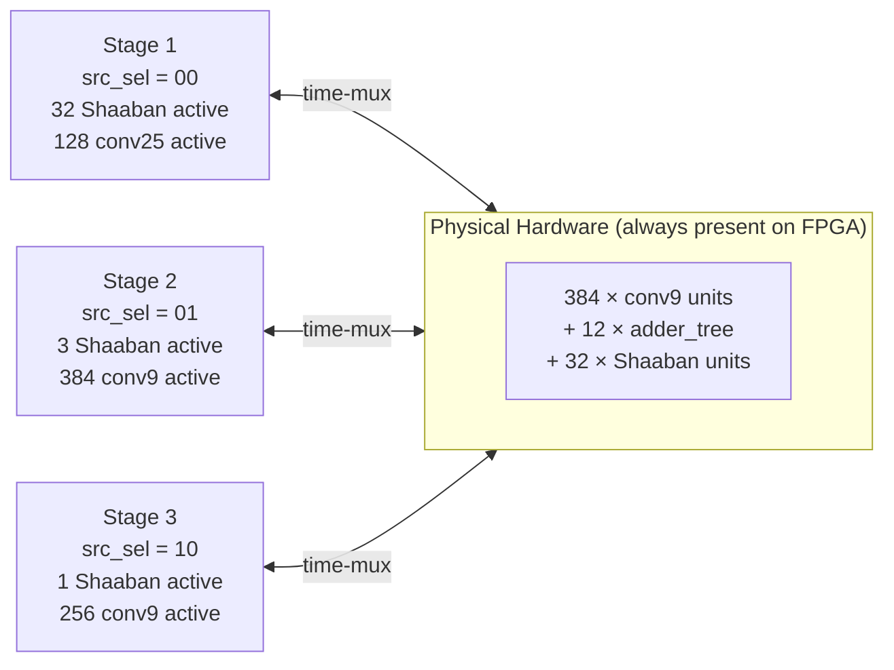
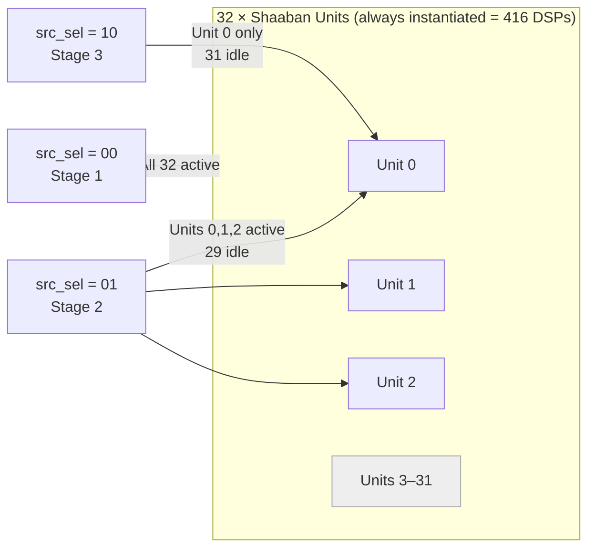
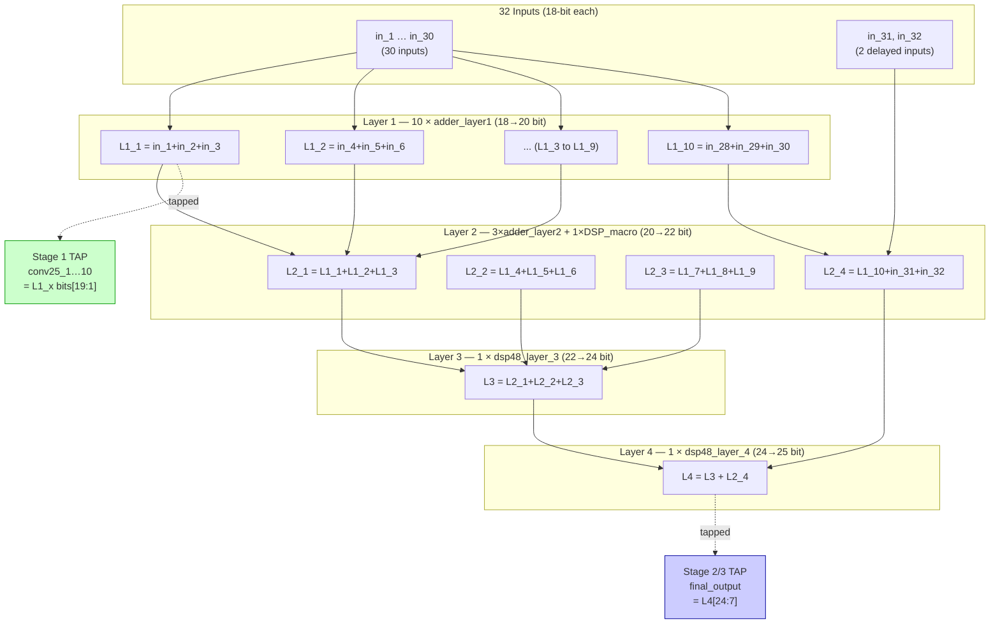
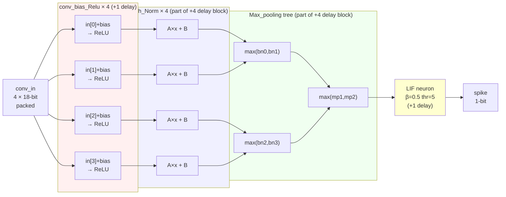
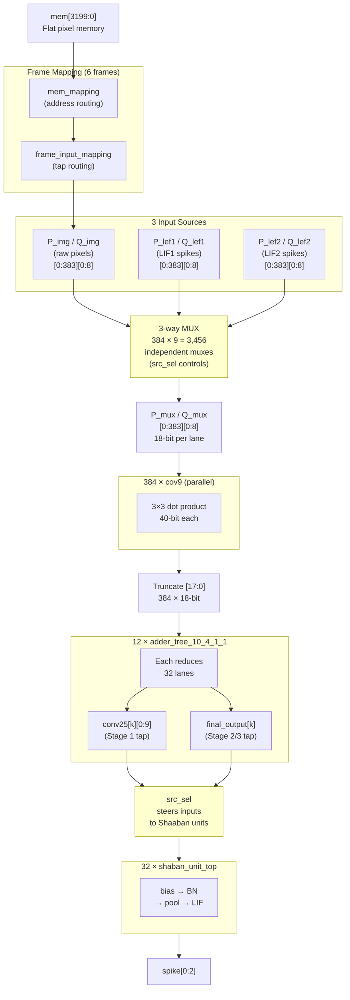
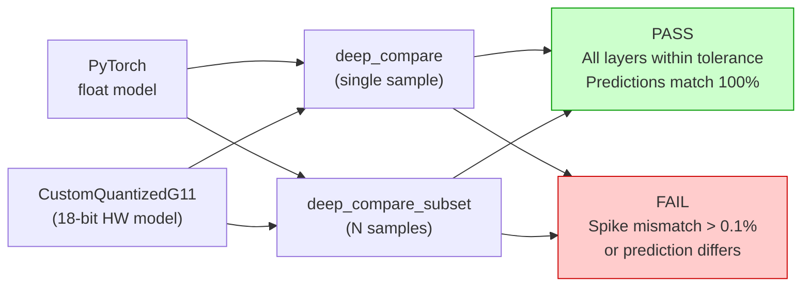
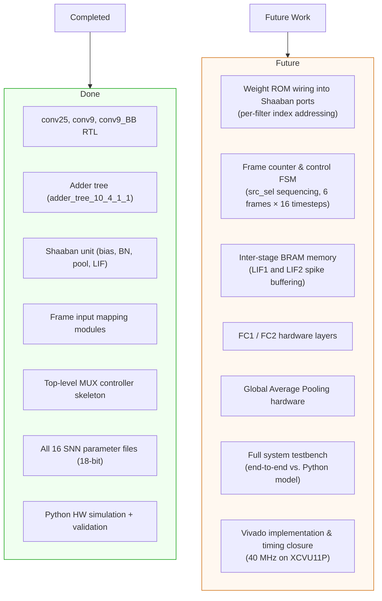

# MultiStage-DeepSNN: FPGA Accelerator for a Spiking Neural Network

**Target Device:** Xilinx Virtex UltraScale+ `xcvu11p-flga2577-3-e`
**Operating Frequency:** 40 MHz
**Data Precision:** 18-bit signed fixed-point (8 integer bits + 10 fractional bits)
**Task:** Real-time driving-incident classification (4 classes)

---

## Table of Contents

1. [Project Overview](#1-project-overview)
2. [Backtracking Architecture Approach](#2-backtracking-architecture-approach)
3. [AI Model: DeepSNNClassification_g11](#3-ai-model-deepsnncclassification_g11)
4. [Fixed-Point Quantization](#4-fixed-point-quantization)
5. [Three-Stage Hardware Pipeline](#5-three-stage-hardware-pipeline)
6. [Memory Control & Frame Mapping](#6-memory-control--frame-mapping)
7. [Critical Path & Timing Analysis](#7-critical-path--timing-analysis)
8. [DSP Resource Allocation](#8-dsp-resource-allocation)
9. [Block RAM (BRAM)](#9-block-ram-bram)
10. [RTL Module Reference](#10-rtl-module-reference)
    - [Convolution Blocks](#101-convolution-blocks)
    - [Optimized Adder Tree](#102-optimized-adder-tree-rtladder-tree)
    - [Shaaban Unit (Backend Pipeline)](#103-shaaban-unit-backend-pipeline)
    - [Frame Input Mapping](#104-frame-input-mapping)
    - [Top-Level Module & MUX Controller](#105-top-level-module--mux-controller)
11. [SNN Parameters](#11-snn-parameters)
12. [Python Reference Model (main.py)](#12-python-reference-model-mainpy)
13. [Repository Structure](#13-repository-structure)
14. [Future Work](#14-future-work)

---

## 1. Project Overview

**MultiStage-DeepSNN** is a fully custom, parallel hardware accelerator that implements a trained Spiking Neural Network (SNN) on a Xilinx Virtex UltraScale+ FPGA. The network classifies short dashcam video clips into four driving-event categories:

| Label | Class | Description |
|-------|-------|-------------|
| 0 | `negative_samples` | No incident |
| 1 | `drifting_or_skidding` | Risky manoeuvre, no impact |
| 2 | `other_crash` | Crash — ego vehicle NOT involved |
| 3 | `collision` | Crash — ego vehicle involved |

Each inference processes **16 temporal frames** of a **256×256** grayscale input image. The design uses a **backtracking-derived sliding-window** approach that determines the minimum input crop needed to produce one output, then tiles those crops across the image. Three deeply pipelined SNN stages are followed by Global Average Pooling and two fully-connected layers.

### System-Level Data Flow

```mermaid
flowchart LR
    A["256×256\nInput Image\n(16 frames)"]
    B["Memory\nController\n6 Frames"]
    C["Stage 1\n5×5 Conv → BN\n→ Pool → LIF1\n128 conv25 units"]
    D["Stage 2\n3×3 Conv → BN\n→ Pool → LIF2\n384 conv9 units"]
    E["Stage 3\n3×3 Conv → BN\n→ Pool → LIF3\n256 conv9 units"]
    F["GAP\n4×4×128\n→ 128"]
    G["FC1\n128→256\nReLU"]
    H["FC2\n256→4"]
    I["Class\n0-3"]

    A --> B --> C -->|"LIF1 spikes\n10×10×32"| D -->|"LIF2 spikes\n4×4×64"| E -->|"LIF3 spikes\n1×1×128\n(×16 crops)"| F --> G --> H --> I

    style C fill:#ffcccc,stroke:#cc0000
    style D fill:#ffe0cc,stroke:#cc6600
    style E fill:#fff0cc,stroke:#cc9900
    style F fill:#ccffcc,stroke:#006600
    style G fill:#ccffcc,stroke:#006600
    style H fill:#ccffcc,stroke:#006600
```



The key hardware goals are:

- **Maximize parallelism** — hundreds of convolution units run simultaneously across the full input window.
- **Minimize DSP count** — 3-input DSP48E2 adder trees and output-level tapping halve channel-accumulation resource requirements.
- **Share silicon** — a single pool of 32 Shaaban backend units serves all three stages via a 3-way MUX controller, eliminating redundant hardware across stages.

---

## 2. Backtracking Architecture Approach

The core design philosophy is **backtracking**: instead of designing forward from a full 256×256 input, we start from the desired output — a single LIF3 spike at position (1×1) — and trace backwards through every layer to determine the exact minimum input window required.

### Reverse Derivation

Working backwards through all layers (no zero-padding is used in any convolution):

```
        DESIRED OUTPUT                        REQUIRED INPUT
        ──────────────                        ──────────────

   LIF3:  1×1 ──── MaxPool3 (×2) ──────────► 2×2  before pooling
          2×2 ──── CONV3 3×3 (+2 each side) ► 4×4  = 2+3−1
                                               │
   LIF2:  4×4 ──── MaxPool2 (×2) ──────────► 8×8  before pooling
          8×8 ──── CONV2 3×3 (+2 each side) ► 10×10 = 8+3−1
                                               │
   LIF1: 10×10 ─── MaxPool1 (×2) ──────────► 20×20 before pooling
         20×20 ─── CONV1 5×5 (+4 each side) ► 24×24 = 20+5−1
                                               │
                                        ┌──────▼──────┐
                                        │   24×24     │
                                        │  INPUT CROP │
                                        └─────────────┘
```

**Result:** A single **24×24 crop** from the input image, when passed through the full three-stage SNN pipeline, produces exactly **one LIF3 output pixel** (across 128 channels).

### Backtracking Derivation Table

| Step (backwards) | Operation | Spatial size |
|------------------|-----------|-------------|
| LIF3 output target | — | **1×1** |
| Before MaxPool3 | ×2 each side | 2×2 |
| Before CONV3 (3×3, no pad) | +kernel−1 = +2 | **4×4** |
| LIF2 output needed | — | 4×4 |
| Before MaxPool2 | ×2 each side | 8×8 |
| Before CONV2 (3×3, no pad) | +2 | **10×10** |
| LIF1 output needed | — | 10×10 |
| Before MaxPool1 | ×2 each side | 20×20 |
| Before CONV1 (5×5, no pad) | +kernel−1 = +4 | **24×24** |

### Tiling 16 Crops Over the 256×256 Image

The full LIF3 output is a **4×4 spatial grid** of 16 positions. Each position maps to an independent 24×24 crop of the input image, processed across 6 computational frames:

```
  256×256 Input Image
  ┌─────────────────────────────────────────────────┐
  │ ┌──────┐ ┌──────┐ ┌──────┐ ┌──────┐            │
  │ │24×24 │ │24×24 │ │24×24 │ │24×24 │            │
  │ │crop 0│ │crop 1│ │crop 2│ │crop 3│            │
  │ └──┬───┘ └──┬───┘ └──┬───┘ └──┬───┘            │
  │    │        │        │        │                 │
  │ ┌──┴───┐ ┌──┴───┐ ┌──┴───┐ ┌──┴───┐            │
  │ │24×24 │ │24×24 │ │24×24 │ │24×24 │            │
  │ │crop 4│ │crop 5│ │crop 6│ │crop 7│            │
  │ └──────┘ └──────┘ └──────┘ └──────┘            │
  │    ...      ...      ...      ...               │
  │ ┌──────┐ ┌──────┐ ┌──────┐ ┌──────┐            │
  │ │crop12│ │crop13│ │crop14│ │crop15│            │
  │ └──────┘ └──────┘ └──────┘ └──────┘            │
  └─────────────────────────────────────────────────┘
                        │
                        ▼  3-stage SNN pipeline (×16 crops over 6 frames)
                        │
  ┌───┬───┬───┬───┐
  │L00│L01│L02│L03│
  ├───┼───┼───┼───┤   4×4 LIF3 output map (16 elements × 128 channels)
  │L04│L05│L06│L07│
  ├───┼───┼───┼───┤
  │L08│L09│L10│L11│
  ├───┼───┼───┼───┤
  │L12│L13│L14│L15│
  └───┴───┴───┴───┘
```

### Per-Stage Spatial Dimensions (one 24×24 crop)

```
  24×24×1 INPUT
       │
       │  CONV1 5×5 no-pad
       ▼
  20×20×32 ──► MaxPool 2×2 ──► 10×10×32 ──► LIF1 ──► 10×10×32 spikes
                                                              │
                                               CONV2 3×3 no-pad
                                                              ▼
                                         8×8×64 ──► MaxPool 2×2 ──► 4×4×64 ──► LIF2 ──► 4×4×64 spikes
                                                                                                │
                                                                                  CONV3 3×3 no-pad
                                                                                                ▼
                                                                           2×2×128 ──► MaxPool 2×2 ──► 1×1×128 ──► LIF3
                                                                                                                      │
                                                                                                              1 output pixel
                                                                                                             (128 channels)
```

---

## 3. AI Model: DeepSNNClassification_g11

The PyTorch reference model (`python/main.py`) defines the exact computation implemented in hardware. Each of the three blocks follows:

```
Conv2D (no padding) → BatchNorm (fused affine) → MaxPool 2×2 → LIF neuron
```

After all T=16 temporal frames complete, the classifier runs:

```
Global Average Pool → FC1 (ReLU) → FC2 → 4 class scores
```

### Full Network Architecture

```mermaid
flowchart TD
    IN["Input\n24×24×1\n(T=16 frames)"]

    subgraph B1["Block 1 — Stage 1 Hardware"]
        C1["Conv1\n5×5, 1→32 ch\nno padding\n→ 20×20×32"]
        BN1["BatchNorm1\nFused: A·x + B\n→ 20×20×32"]
        P1["MaxPool\n2×2\n→ 10×10×32"]
        L1["LIF1\nβ=0.5, thr=5\n10×10×32 spikes"]
    end

    subgraph B2["Block 2 — Stage 2 Hardware"]
        C2["Conv2\n3×3, 32→64 ch\nno padding\n→ 8×8×64"]
        BN2["BatchNorm2\nFused: A·x + B\n→ 8×8×64"]
        P2["MaxPool\n2×2\n→ 4×4×64"]
        L2["LIF2\nβ=0.5, thr=5\n4×4×64 spikes"]
    end

    subgraph B3["Block 3 — Stage 3 Hardware"]
        C3["Conv3\n3×3, 64→128 ch\nno padding\n→ 2×2×128"]
        BN3["BatchNorm3\nFused: A·x + B\n→ 2×2×128"]
        P3["MaxPool\n2×2\n→ 1×1×128"]
        L3["LIF3\nβ=0.5, thr=5\n1×1×128 spikes"]
    end

    subgraph CLS["Classifier (Future Work)"]
        GAP["Global Avg Pool\n4×4×128 → 128"]
        FC1["FC1\n128→256, ReLU"]
        FC2["FC2\n256→4"]
    end

    OUT["Class Score\n0 / 1 / 2 / 3"]

    IN --> C1 --> BN1 --> P1 --> L1
    L1 --> C2 --> BN2 --> P2 --> L2
    L2 --> C3 --> BN3 --> P3 --> L3
    L3 -->|"×16 crops\ncollected"| GAP --> FC1 --> FC2 --> OUT

    style B1 fill:#fff0f0,stroke:#cc0000
    style B2 fill:#fff8f0,stroke:#cc6600
    style B3 fill:#fffff0,stroke:#cc9900
    style CLS fill:#f0fff0,stroke:#006600
```



### Layer-by-Layer Specification

| Block | Layer | Parameters | Input Shape | Output Shape |
|-------|-------|------------|-------------|--------------|
| 1 | Conv1 | 1→32 ch, 5×5, **no padding**, stride=1 | 24×24×1 | 20×20×32 |
| 1 | BatchNorm1 | 32 ch, fused to A·x+B | 20×20×32 | 20×20×32 |
| 1 | MaxPool1 | 2×2, stride=2 | 20×20×32 | 10×10×32 |
| 1 | LIF1 | β=0.5, threshold=5 | 10×10×32 | 10×10×32 spikes |
| 2 | Conv2 | 32→64 ch, 3×3, **no padding**, stride=1 | 10×10×32 | 8×8×64 |
| 2 | BatchNorm2 | 64 ch, fused | 8×8×64 | 8×8×64 |
| 2 | MaxPool2 | 2×2, stride=2 | 8×8×64 | 4×4×64 |
| 2 | LIF2 | β=0.5, threshold=5 | 4×4×64 | 4×4×64 spikes |
| 3 | Conv3 | 64→128 ch, 3×3, **no padding**, stride=1 | 4×4×64 | 2×2×128 |
| 3 | BatchNorm3 | 128 ch, fused | 2×2×128 | 2×2×128 |
| 3 | MaxPool3 | 2×2, stride=2 | 2×2×128 | 1×1×128 |
| 3 | LIF3 | β=0.5, threshold=5 | 1×1×128 | 1×1×128 spikes |
| — | GAP | Global average pool | 4×4×128 (16 crops) | 128 |
| — | FC1 | 128→256, ReLU | 128 | 256 |
| — | FC2 | 256→4 | 256 | 4 |

The forward pass repeats for each of the **T=16 temporal frames**. Membrane potentials accumulate across timesteps, enabling temporal spike integration.

### LIF Neuron Hardware Formulation

```
  PREVIOUS CYCLE                    CURRENT CYCLE
  ─────────────                     ─────────────
  mem_reg ──► ( >>> 1 ) ──────────► mem_leak      [β = 0.5: arithmetic right-shift]
                                         │
  in_pool ──────────────────────────────►(+)──────► mem_input
                                                         │
  spike_reg ──► ( × threshold ) ────────────────────────►(−)──► new_mem
                                                                     │
                                              (new_mem ≥ threshold) ?─► spike = 1
                                                                     └─► spike = 0
                                                                              │
                                                                         ┌────▼─────┐
                                                                         │ Register │──► spike_reg (next cycle)
                                                                         └──────────┘
```

The reset is "delayed by one cycle" — `spike_reg` (previous cycle's output) subtracts the threshold from the current integration, preventing immediate re-firing.

---

## 4. Fixed-Point Quantization

All weights, activations, and intermediate results use **18-bit signed fixed-point** representation.

### Number Format

```
  Bit 17          Bit 10  Bit 9              Bit 0
  ┌───┬──────────────────┬──────────────────────┐
  │ S │  Integer (7 b)   │  Fraction (10 b)     │
  └───┴──────────────────┴──────────────────────┘
    │                                    │
  Sign bit                      Scale = 2¹⁰ = 1024

  Range:  −128.000  to  +127.999 (step ≈ 0.000977)
  Format: Q7.10  (signed, 8 integer bits including sign, 10 fractional bits)
```

### DSP48E2 Arithmetic Mapping

```
  OPERATION          HARDWARE IMPLEMENTATION            DSP SLICES USED
  ─────────────────  ─────────────────────────────────  ───────────────
  18-bit × 18-bit    2 × DSP48E2 (product too wide       2 DSPs
  multiply           for a single slice)

  3-input add        1 × DSP48E2 using pre-adder port    1 DSP
  (A + D + C)        D + A (pre-adder) → feed into C     (replaces 2 separate adds)
```

Using 3-input DSP adders instead of 2-input binary trees yields **~50% fewer adder DSPs** in the channel accumulation stage.

| Parameter | Value |
|-----------|-------|
| Total bits | 18 |
| Integer bits | 8 (including sign) |
| Fractional bits | 10 |
| Scale factor | 2¹⁰ = 1024 |
| Range | −128.000 to +127.999 |

---

## 5. Three-Stage Hardware Pipeline

The three SNN blocks map to distinct hardware configurations. The same physical resources (conv9 units, Shaaban units, adder trees) are time-multiplexed across stages via the `src_sel` MUX controller.

### Hardware Sharing Overview



### Stage 1 — 5×5 Convolution (conv25)

```
  Input pixels (24×24 crop)
        │
        ▼
  128 × conv25 units ────────────────────────────────────────► (parallel, combinational)
  │  Each conv25: 3×conv9_BB + 1×mult = 25-element dot product │
  │  27 DSPs per unit × 128 units = 3,456 DSPs conv             │
  └──────────────────────────────────────────────────────────────┘
        │ 40-bit outputs, truncated to 18-bit
        ▼
  12 × adder_tree_10_4_1_1  (120 DSPs adder tree + 8 DSPs extra)
        │ conv25[k][0:9]  intermediate partial sums (Stage 1 tap)
        ▼
  32 × shaban_unit_top — ALL 32 ACTIVE (416 DSPs)
  [bias → BN → pool → LIF]
        │
        ▼
  32 LIF1 spike outputs   Throughput: 32 pixels/cycle   Cycles: 100
  ──────────────────────────────────────────────────────────────
  Total DSPs Stage 1: 3,456 + 120 + 8 + 416 = 4,000  (98.1%)
```

### Stage 2 — 3×3 Convolution (conv9), 32 Input Channels

```
  LIF1 spike map (10×10×32)
        │
        ▼
  384 × conv9 units ─────────────────────────────────────────► (parallel, combinational)
  │  Each conv9: 9-element dot product                         │
  │  9 DSPs per unit × 384 units = 3,456 DSPs conv             │
  └──────────────────────────────────────────────────────────────┘
        │ 40-bit outputs, truncated to 18-bit
        ▼
  12 × adder_tree_10_4_1_1  (192 DSPs — 32-input, 4-layer optimized)
        │ final_output[k]   full 32-channel accumulated sums (Stage 2 tap)
        ▼
  3 of 32 × shaban_unit_top — ONLY 3 ACTIVE (39 DSPs; 29 idle)
        │
        ▼
  3 LIF2 spike outputs     Throughput: 3 pixels/cycle   Cycles: 352
  ──────────────────────────────────────────────────────────────
  Total DSPs Stage 2: 3,456 + 192 + 39 = 3,687  (90.5%)
```

### Stage 3 — 3×3 Convolution (conv9), 64 Input Channels

```
  LIF2 spike map (4×4×64)
        │
        ▼
  256 × conv9 units ─────────────────────────────────────────►
  │  9 DSPs per unit × 256 units = 2,304 DSPs conv             │
  └──────────────────────────────────────────────────────────────┘
        │ 40-bit outputs, truncated to 18-bit
        ▼
  6 × adder_tree_10_4_1_1 + Layer 5 accumulation  (132 DSPs — 64-input, 5-layer)
        │ final_output after full 64-channel reduction (Stage 3 tap)
        ▼
  1 of 32 × shaban_unit_top — ONLY 1 ACTIVE (13 DSPs; 31 idle)
        │
        ▼
  1 LIF3 spike output      Throughput: 1 pixel/cycle   Cycles: 128
  ──────────────────────────────────────────────────────────────
  Total DSPs Stage 3: 2,304 + 132 + 13 = 2,449  (60.1%)
```

### Stage Comparison Summary

| Parameter | Stage 1 | Stage 2 | Stage 3 |
|-----------|---------|---------|---------|
| Kernel size | 5×5 | 3×3 | 3×3 |
| Conv units | 128 × conv25 | 384 × conv9 | 256 × conv9 |
| Input channels | 1 | 32 | 64 |
| Output channels | 32 | 64 | 128 |
| Adder tree depth | 4 layers | 4 layers | 5 layers |
| Active Shaaban units | 32 | 3 | 1 |
| Throughput | 32 px/cycle | 3 px/cycle | 1 px/cycle |
| Total DSPs | **4,000** (98.1%) | **3,687** (90.5%) | **2,449** (60.1%) |

**Overall circuit DSP total:**
```
  4,000 + (4+1+1)×12 + 4  =  4,000 + 72 + 4  =  4,076 / 4,638  (87.9%)
```

---

## 6. Memory Control & Frame Mapping

### Motivation

Processing all 16 LIF3 output positions simultaneously would require enormous memory bandwidth. Instead, the memory controller tiles the 16 positions across **6 sequential computational frames**, time-sharing the hardware.

### From 12 Convolutions to 3 LIF Outputs

Each processing frame drives **12 parallel convolution results**, grouped in sets of 4. Each group feeds one Shaaban unit's 4-input max-pooling tree, producing one LIF output:

```
  12 conv outputs (one frame)
  ┌──────────────────────────────────────────────────────────┐
  │                                                          │
  │  Group 1: [conv_0] [conv_1] [conv_2] [conv_3]           │
  │               │       │       │       │                  │
  │               └───┬───┘       └───┬───┘                  │
  │             Max(a,b)         Max(c,d)                    │
  │                   └──────┬──────┘                        │
  │                       Max(ab,cd)                         │
  │                           │                              │
  │                         LIF ──────────────► LIF output 0 │
  │                                                          │
  │  Group 2: [conv_4] [conv_5] [conv_6] [conv_7]  ──► LIF output 1
  │                                                          │
  │  Group 3: [conv_8] [conv_9] [conv_10][conv_11] ──► LIF output 2
  │                                                          │
  └──────────────────────────────────────────────────────────┘
            1 frame  →  3 LIF outputs
```

### Frame Schedule (6 Frames → 16 LIF Outputs)

```
  Frame │ LIF outputs produced │ 4×4 grid positions filled
  ──────┼──────────────────────┼──────────────────────────────────────────
    1   │          3           │  ┌─┬─┬─┬─┐    ■ = filled this frame
        │                      │  │■│■│■│ │
        │                      │  ├─┼─┼─┼─┤
        │                      │  │ │ │ │ │
        │                      │  ├─┼─┼─┼─┤
        │                      │  │ │ │ │ │
        │                      │  ├─┼─┼─┼─┤
        │                      │  │ │ │ │ │    Cumulative: 3 / 16
  ──────┼──────────────────────┼──┴─┴─┴─┴─┘
    2   │          3           │  positions  4, 5, 6       Cumulative:  6
    3   │          3           │  positions  7, 8, 9       Cumulative:  9
    4   │          3           │  positions 10,11,12       Cumulative: 12
    5   │          3           │  positions 13,14,15       Cumulative: 15
    6   │          1           │  position  16             Cumulative: 16
  ──────┴──────────────────────┴───────────────────────────────────────
  Total │         16 LIF outputs (4×4 map complete)
```

Frame 6 produces only 1 LIF output — the final corner position of the 4×4 grid.

The frame counter is controlled by the `mem_mapping` and `frame_input_mapping` RTL modules, which perform address-level routing from the flat `mem[3199:0]` bus into the correct 24×24-crop filter taps for each frame.

---

## 7. Critical Path & Timing Analysis

All delay figures are in **DSP cascade delay units** (1 unit = one DSP48E2 pipeline stage latency; multiplier delay = adder delay = 1 unit).

### Shaaban Unit Critical Path (6 delays)

```
  conv_in (4 values)
       │
       ▼ ─────────────────────────────────────────  Delay count
  4× conv_bias_Relu    [add bias + ReLU clamp]         +1
       │
       ▼
  4× Batch_Norm        [A × x + B,  DSP48E2 MAC]  ─┐
       │                                            │  +4  (combined BN + Pool block)
       ▼                                            │
  2× Max_pooling (4→2) [combinational max]          │
       │                                            │
       ▼                                            │
  1× Max_pooling (2→1) [combinational max]         ─┘
       │
       ▼
  LIF neuron           [mem >>> 1 → integrate → compare]  +1
       │
       ▼
  spike (1-bit)                                TOTAL: 6 delays
```

### Full Stage Critical Path Breakdown

```
                    Conv          Adder Tree     Shaaban     TOTAL
                   (delays)        (delays)      (delays)   (delays)
  ─────────────────────────────────────────────────────────────────
  Stage 1   conv25 [■■■■■■■■■■]  none             [■■■■■■]    16
  Stage 2   conv9  [■■■■■■■■■]   L1-L4 [■■■■]    [■■■■■■]    19
  Stage 3   conv9  [■■■■■■■■■]   L1-L5 [■■■■■]   [■■■■■■]    20  ← bounding path
  ─────────────────────────────────────────────────────────────────
  Key:  ■ = 1 DSP cascade delay unit     Target: 40 MHz
```



```mermaid
gantt
    title Critical Path Delay Breakdown (DSP delay units)
    dateFormat X
    axisFormat %s

    section Stage 1  (16 total)
    conv25  (10 delays)    :s1c, 0, 10
    Shaaban (6 delays)     :s1s, after s1c, 6

    section Stage 2  (19 total)
    conv9   (9 delays)     :s2c, 0, 9
    Adder Tree (4 delays)  :s2a, after s2c, 4
    Shaaban (6 delays)     :s2s, after s2a, 6

    section Stage 3  (20 total — BOUND)
    conv9   (9 delays)     :s3c, 0, 9
    Adder Tree (5 delays)  :s3a, after s3c, 5
    Shaaban (6 delays)     :s3s, after s3a, 6
```

The entire network is bounded by **Stage 3 at 20 delay units**, setting the maximum achievable frequency at **40 MHz**.

---

## 8. DSP Resource Allocation

### Budget Overview

```
  XCVU11P available DSP48E2 slices: 4,638
  ───────────────────────────────────────────────────────────────────
  Stage 1  ████████████████████████████████████████████████  4,000 (98.1%)
  Stage 2  ██████████████████████████████████████████        3,687 (90.5%)
  Stage 3  ████████████████████████████                      2,449 (60.1%)
  ───────────────────────────────────────────────────────────────────
  Circuit  █████████████████████████████████████████         4,076 (87.9%)
```

### Global Constraints

Total available: **4,638 DSP48E2** slices on the XCVU11P.

```
  Maximum multipliers per stage: 2,314
  Maximum adders per stage:      2,324
```

### Shaaban Unit Sharing

Exactly **32 Shaaban units** are physically present on-chip at all times (416 DSPs). Active usage is gated by `src_sel`:



| Stage | Active Units | Active DSPs | Idle Units | Idle DSP Overhead |
|-------|-------------|-------------|------------|-------------------|
| 1 | 32 | 416 | 0 | 0 |
| 2 | 3 | 39 | 29 | 377 (unavoidable, static) |
| 3 | 1 | 13 | 31 | 403 (unavoidable, static) |

### Full DSP Breakdown Table

| Component | Stage 1 | Stage 2 | Stage 3 |
|-----------|---------|---------|---------|
| Conv units | 128 × conv25 | 384 × conv9 | 256 × conv9 |
| Conv DSPs | 128×27 = **3,456** | 384×9 = **3,456** | 256×9 = **2,304** |
| Adder tree DSPs | **120** | **192** | **132** |
| Extra ADD (conv25) | **8** | N/A | N/A |
| Shaaban DSPs (active) | **416** (32 units) | **39** (3 units) | **13** (1 unit) |
| **Total DSPs** | **4,000** (98.1%) | **3,687** (90.5%) | **2,449** (60.1%) |

---

## 9. Block RAM (BRAM)

The Xilinx Virtex UltraScale+ XCVU11P provides **2,016 Block RAM tiles** with a total on-chip capacity of **70.9 Mb**.

```
  ┌─────────────────────────────────────────────────────────────┐
  │  XCVU11P BRAM Resource                                      │
  │                                                             │
  │  Total tiles:    2,016 × 36 Kb  =  70.9 Mb                 │
  │  Data width:     18-bit (matches fixed-point format)        │
  │                                                             │
  │  Usage:                                                     │
  │  ┌──────────────┐  BRAM  ┌──────────────┐  BRAM  ┌───────┐ │
  │  │   Stage 1    │ ──────►│   Stage 2    │ ──────►│Stage 3│ │
  │  │  (conv25)    │        │   (conv9)    │        │(conv9)│ │
  │  └──────────────┘        └──────────────┘        └───────┘ │
  │        LIF1 spikes stored        LIF2 spikes stored         │
  │        while Stage 2 runs        while Stage 3 runs         │
  └─────────────────────────────────────────────────────────────┘
```

BRAMs hold intermediate spike maps between stages. Because all three stages time-share the same conv9/adder/Shaaban hardware via the MUX controller, BRAM is essential for preserving LIF1 spike outputs while Stage 2 processes them, and LIF2 spike outputs while Stage 3 processes them. The 18-bit data width aligns naturally with BRAM port configurations.

Specific BRAM port configuration, capacity calculations, and read/write scheduling will be detailed in a future update as the complete inter-stage memory architecture is finalized.

---

## 10. RTL Module Reference

All RTL source files are located in the `rtl/` directory.

---

### 10.1 Convolution Blocks

#### `rtl/convolution_blocks/conv9.sv`

A fully combinational **3×3 dot-product unit**. Computes the multiply-accumulate of two 9-element, 18-bit signed vectors.

```
  P[0] ──►[×]──►┐
  Q[0]           │
  P[1] ──►[×]──►│
  Q[1]           ├──► Adder tree (4 levels) ──► Pixel_Out[39:0]
  ...            │        (binary, 9→5→3→2→1)
  P[8] ──►[×]──►┘
  Q[8]

  9 multipliers (parallel) → 4-level binary reduction → 40-bit sum
  DSP critical path depth: 9 delays
```

- **Inputs:** `P[0:8]`, `Q[0:8]` — 18-bit signed pixel and weight vectors
- **Output:** `Pixel_Out[39:0]` — 40-bit result

#### `rtl/convolution_blocks/conv9_BB.sv`

An **8-element building block** used inside `conv25`. Processes only 8 inputs (omitting element 8); its 40-bit output feeds the `conv25` final accumulation stage.

#### `rtl/convolution_blocks/conv25.sv`

A fully combinational **5×5 dot-product unit** built from three `conv9_BB` sub-blocks plus one final multiply:

```
  P[0:7]   ──► conv9_BB ──► Out[0] ─────────────────────────────────┐
  Q[0:7]                                                             │
                                                                     ▼
  P[8:15]  ──► conv9_BB ──► Out[1] ──►(+)──► partial_0     (partial_0 + partial_1)
  Q[8:15]                              ▲                              │
                                       │                              ▼
  P[16:23] ──► conv9_BB ──► Out[2] ─┐ │                        Pixel_Out[39:0]
  Q[16:23]                          │ └── partial_1 ◄──────────────┘
                                    │     (Out[2] + m)
  P[24] ──►[×]──► m ───────────────┘
  Q[24]

  Total: 25 MACs  |  27 DSPs  |  Critical path: 10 delays
```

---

### 10.2 Optimized Adder Tree (`rtl/adder tree/`)

#### Design Motivation: 2-Input vs 3-Input Adder Trees

```
  NAIVE BINARY TREE (32 inputs)        OPTIMIZED 3-INPUT TREE (32 inputs)
  ─────────────────────────────        ──────────────────────────────────
  Layer 1:  16 × 2-input adders        Layer 1:  10 × 3-input adders  (in_1..in_30)
  Layer 2:   8 × 2-input adders        Layer 2:   4 × 3-input adders  (+ in_31, in_32)
  Layer 3:   4 × 2-input adders        Layer 3:   1 × 3-input adder
  Layer 4:   2 × 2-input adders        Layer 4:   1 × 3-input adder
  Layer 5:   1 × 2-input adder
  ─────────────────────────────        ──────────────────────────────────
  Total:    31 adders                  Total:    16 adders  (48% fewer)
  Depth:     5 layers                  Depth:     4 layers  (one layer faster)
```

Each "3-input adder" is a single DSP48E2 using: `D` (pre-adder) + `A` + `C` — all in one pipeline stage.

#### Complete 32-Input Adder Tree Structure



**Output tapping — no multiplexers needed:**

| Output | Tapped from | Used in |
|--------|-------------|---------|
| `conv25_1` … `conv25_10` | Layer 1 outputs `L1_x[19:1]` (18-bit truncation) | Stage 1 Shaaban default path |
| `final_output` | `L4[24:7]` — full 32-channel sum (18-bit truncation) | Stage 2 and Stage 3 |

For Stage 3, six of these trees feed a shared Layer 5 adder. Layer 5 hardware is present but idle during Stage 2 operation.

#### `rtl/adder tree/all_tb.sv`

Constrained-random SystemVerilog testbench. Generates 100 random 18-bit signed input vectors, computes a golden 32-bit reference sum, and verifies the DUT's internal `L4` node and `final_output` match exactly.

---

### 10.3 Shaaban Unit (Backend Pipeline)

The **Shaaban unit** is the shared backend block that runs after every convolution + channel accumulation. It implements bias, ReLU, Batch Normalization, Max Pooling, and LIF spiking in one unified pipeline with a **6-delay critical path**.



#### Sub-Module Details

**`conv_bias_Relu.v`** — bias add + ReLU:
```
  conv_out_bias = conv_in + conv_bias       // 19-bit sum
  conv_out      = max(conv_out_bias, 0)     // ReLU clamp → 18-bit
```

**`Batch_Norm.v`** — fused affine BatchNorm using one DSP48E2 MAC:
```
  A = γ / sqrt(σ² + ε)      ← pre-computed offline
  B = β − γ·μ / sqrt(σ² + ε) ← pre-computed offline
  output = (input × A) + B   → truncated 36→18 bit
```

**`Max_pooling.v`** — combinational 2-input max:
```
  pool_out = (pool_in1 > pool_in2) ? pool_in1 : pool_in2
```

**`LIF.v`** — registered integrate-and-fire (see Section 3 for full signal diagram):
```verilog
assign mem_leak            = mem_reg >>> 1;
assign mem_input_add       = mem_leak + in_pool;
assign mem_input_add_trnuc = mem_input_add[18:1];
assign mux_out             = spike_reg ? threshold : 0;
assign new_mem             = mem_input_add_trnuc - mux_out;
assign spike               = (new_mem >= threshold);
// threshold = 18'd5,  DATA_WIDTH = 18
```

---

### 10.4 Frame Input Mapping

#### `rtl/frame/frame_mapping_iterations_filters.sv`

Controls address-level routing from the flat input memory bus (`mem[3199:0]`) into the per-filter, per-tap arrays used by the convolution units. For each of the 32 filter positions and 40 tap positions, a `case(frame)` statement selects the correct memory word for the current computational frame (1 of 6), implementing the 24×24 sliding-window access pattern across the 256×256 input.

#### `rtl/frame/frame_input_mapping_brackets.sv`

Companion module that maps per-filter memory words into the structured `conv[filter][tap]` arrays consumed by the convolution blocks. Works together with `frame_mapping_iterations_filters.sv` to complete the full input addressing pipeline.

```
  mem[3199:0]  (flat bus: 200 × 16-bit pixels)
       │
       ▼  frame_mapping_iterations_filters.sv
  fil_in[31:0][39:0]  (32 filters × 40 taps)
       │
       ▼  frame_input_mapping_brackets.sv
  conv_in[0:31][0:11][0:8]  (32 filters × 12 conv groups × 9 taps)
       │
       ▼
  conv9 units / conv25 units
```

---

### 10.5 Top-Level Module & MUX Controller

#### `rtl/Top/top.sv` — module `main_circuit_top`

The top-level module that instantiates all submodules and implements the **3-way source MUX controller** enabling hardware sharing across all three SNN stages.

**Port Summary:**

| Port | Dir | Width | Description |
|------|-----|-------|-------------|
| `clk` | in | 1 | System clock |
| `rst` | in | 1 | Synchronous reset |
| `src_sel[1:0]` | in | 2 | Stage selector — MUX control |
| `arst_n` | in | 1 | Asynchronous reset, active-low |
| `enable` | in | 1 | Frame counter enable |
| `mem[3199:0]` | in | 3200 | Flat input image memory |
| `conv_bias[17:0]` | in | 18 | Shared convolution bias |
| `mult_wight[17:0]` | in | 18 | Shared BN multiplicative weight A |
| `add_wight[17:0]` | in | 18 | Shared BN additive weight B |
| `spike[0:2]` | out | 3 | LIF spike outputs (Shaaban units 0, 1, 2) |

**MUX Controller — `src_sel` Truth Table:**

| `src_sel` | Stage | Input to conv9 array | Active Shaaban | Shaaban input |
|-----------|-------|----------------------|----------------|---------------|
| `2'b00` | Stage 1 | `P_img` / `Q_img` (raw pixels) | **32** | Paired `adder_conv25[k][0..7]` partial sums |
| `2'b01` | Stage 2 | `P_lef1` (LIF1 spikes) | **3** (units 0,1,2) | `adder_final_output[s×4 + t]` (32-ch sums) |
| `2'b10` | Stage 3 | `P_lef2` (LIF2 spikes) | **1** (unit 0) | `adder_final_output[0]` (64-ch sum); others → 0 |

**Complete Internal Data Flow:**



The input MUX is a fully parallel `generate` loop over 384×9 = **3,456 independent combinational 3-to-1 multiplexers** — zero additional pipeline delay.

---

## 11. SNN Parameters

All trained network weights and biases are stored as **18-bit signed fixed-point `localparam`** declarations in the `rtl/SNN Parameters/` directory. They are directly `include`-able into the RTL without any run-time memory loading.

### Parameter File Summary

```
  rtl/SNN Parameters/
  ├── CONV1_WEIGHTS.sv  ── [32][1][25]   32 filters × 1 ch × 5×5   (800 values)
  ├── CONV1_BIAS.sv     ── [32]          all ZERO
  ├── BN1_WEIGHTS.sv    ── [32]          fused affine scale A
  ├── BN1_BIAS.sv       ── [32]          fused affine offset B
  │
  ├── CONV2_WEIGHTS.sv  ── [64][32][9]   64 filters × 32 ch × 3×3  (18,432 values)
  ├── CONV2_BIAS.sv     ── [64]          all ZERO
  ├── BN2_WEIGHTS.sv    ── [64]          fused affine scale A
  ├── BN2_BIAS.sv       ── [64]          fused affine offset B
  │
  ├── CONV3_WEIGHTS.sv  ── [128][64][9]  128 filters × 64 ch × 3×3 (73,728 values)
  ├── CONV3_BIAS.sv     ── [128]         all ZERO
  ├── BN3_WEIGHTS.sv    ── [128]         fused affine scale A
  ├── BN3_BIAS.sv       ── [128]         fused affine offset B
  │
  ├── FC1_WEIGHTS.sv    ── [256][128]    (32,768 values)
  ├── FC1_BIAS.sv       ── [256]
  ├── FC2_WEIGHTS.sv    ── [4][256]      (1,024 values)
  └── FC2_BIAS.sv       ── [4]
```

### Batch Normalization Fusion

The hardware stores BatchNorm as a two-constant affine transform computed offline:

```
  PyTorch training parameters:        Hardware parameters (pre-fused):
  ──────────────────────────          ────────────────────────────────
  γ  (weight)                         A = γ / sqrt(σ² + ε)
  β  (bias)              ───────►     B = β − γ·μ / sqrt(σ² + ε)
  μ  (running mean)
  σ² (running variance)               output = A·x + B   (one DSP MAC)
```

No BatchNorm statistics are needed at inference time — A and B are fixed RTL constants.

> **Note:** Convolution biases for all three stages are identically zero in the current trained model. The `conv_bias_Relu` block retains the bias port for generality, but the current parameters produce no effect.

---

## 12. Python Reference Model (main.py)

`python/main.py` serves three distinct purposes:

### 1. PyTorch Floating-Point Reference (`DeepSNNClassification_g11`)

The original trained model in PyTorch + snnTorch. Processes input in `(B, T, H, W, C)` format. Uses `surrogate.atan()` gradient during training. This model is the numerical ground truth.

### 2. Hardware Simulation Wrapper (`CustomQuantizedG11`)

A Numba-accelerated Python reimplementation of the exact hardware computation — 18-bit fixed-point, β=0.5 right-shift, reset-delay LIF — mirroring the RTL structure:

```python
# Per temporal frame t:
out  = myConv2D_numba(xt, w, b, stride=1, padding=0, quant=True, ...)
out  = myBatchNorm_numba(out, A, B, quant=True, ...)
out  = myMaxPool2D_numba(out)                          # 2×2 max pool
spk, mem = myLIF_numba_quant(spk, out, mem,
               beta=0.5, threshold=5, quant=True, ...) # hardware-accurate

# After T=16 frames:
out = myGAP_numba(spk3, ...)                           # global average pool
out = myDense_numba(out, W_fc1, b_fc1, relu=True, ...) # FC1 + ReLU
out = myDense_numba(out, W_fc2, b_fc2, relu=False, ...)# FC2
```

### 3. Validation Suite



### Key Differences: Training vs. Hardware

| Parameter | PyTorch Training | RTL Hardware |
|-----------|-----------------|--------------|
| LIF decay β | 0.9 (trained, snnTorch `Leaky`) | **0.5** (right-shift by 1) |
| LIF threshold | 1.0 (float) | **5** (18-bit fixed-point) |
| Data type | float32 | **18-bit signed fixed-point** |
| BatchNorm | γ, β, μ, σ² separate | **Pre-fused A and B constants** |
| Conv bias | float | **All-zero (trained outcome)** |

---

## 13. Repository Structure

```
MultiStage-DeepSNN/
│
├── python/
│   └── main.py                     # PyTorch model + Numba HW sim + validation
│
├── rtl/
│   ├── convolution_blocks/
│   │   ├── conv9.sv                # 3×3 (9-MAC) dot product — 9 DSP delays
│   │   ├── conv9_BB.sv             # 8-element building block for conv25
│   │   └── conv25.sv               # 5×5 (25-MAC) dot product — 10 delays, 27 DSPs
│   │
│   ├── adder tree/
│   │   ├── adder_layer1.v          # DSP48E2 3-input adder: 18-bit → 20-bit
│   │   ├── adder_layer2.v          # DSP48E2 3-input adder: 20-bit → 22-bit
│   │   ├── adder_tree_10_4_1_1.v   # 32-input optimized tree (16 adders, dual-tap)
│   │   └── all_tb.sv               # Constrained-random testbench (100 vectors)
│   │
│   ├── Shabaan Unit/
│   │   ├── conv_bias_Relu.v        # Bias add + ReLU
│   │   ├── Batch_Norm.v            # Fused affine BN: A·x + B (DSP48E2 MAC)
│   │   ├── Max_pooling.v           # 2-input combinational max
│   │   ├── LIF.v                   # LIF neuron: β=0.5, threshold=5, reset-delay
│   │   └── shaban_unit_top.v       # Backend pipeline: bias→BN→pool→LIF (6 delays)
│   │
│   ├── frame/
│   │   ├── frame_mapping_iterations_filters.sv  # Memory → filter address routing
│   │   └── frame_input_mapping_brackets.sv      # Filter tap routing (6 frames)
│   │
│   ├── Top/
│   │   └── top.sv                  # main_circuit_top: 3-way MUX + full integration
│   │
│   └── SNN Parameters/             # 18-bit fixed-point weight/bias localparams
│       ├── CONV1_WEIGHTS.sv        # [32][1][25]  — 800 values
│       ├── CONV2_WEIGHTS.sv        # [64][32][9]  — 18,432 values
│       ├── CONV3_WEIGHTS.sv        # [128][64][9] — 73,728 values
│       ├── CONV{1,2,3}_BIAS.sv     # All zeros
│       ├── BN{1,2,3}_WEIGHTS.sv    # Fused affine scale A
│       ├── BN{1,2,3}_BIAS.sv       # Fused affine offset B
│       ├── FC1_WEIGHTS.sv          # [256][128]
│       ├── FC1_BIAS.sv             # [256]
│       ├── FC2_WEIGHTS.sv          # [4][256]
│       └── FC2_BIAS.sv             # [4]
│
├── docs/
│   ├── Adder Tree Architecture.pdf         # 3-input tree optimization analysis
│   ├── DSP Synthesis.pdf                   # DSP48E2 timing & resource analysis
│   ├── SNN Architecture & Utilization.pdf  # Critical path, DSP budget, cycle counts
│   └── SNN Architecture Optimization.pdf   # Alternative critical path analysis
│
├── Schematics/
│   ├── BackTrack.png               # Backtracking window derivation (24×24 → 1 LIF)
│   ├── CONV25.png                  # conv25 block diagram
│   ├── LIF_arch.jpg                # LIF neuron architecture
│   ├── LIF_details.jpg             # LIF internal signal timing
│   ├── BN_MaxPool.png              # BatchNorm + MaxPool (Patch_Pool) schematic
│   ├── GlobalAveragePooling.png    # GAP layer diagram
│   ├── FC1_Layer.png               # FC1 hardware layout
│   ├── Spiking_NN(LIF).png         # Full 3-stage SNN block diagram
│   └── all_stages.drawio           # Complete architecture (all modules, all stages)
│
└── Sheet/
    └── HW SPECS.xlsx               # Detailed hardware specification spreadsheet
```

---

## 14. Future Work

The following components are planned for completion in subsequent development phases. This README will be updated accordingly as each component is completed.



| Priority | Component | Description |
|----------|-----------|-------------|
| High | Weight ROM instantiation | Wire `CONV{1,2,3}_WEIGHTS`, `BN{1,2,3}_WEIGHTS/BIAS` into Shaaban `mult_wight` / `add_wight` / `conv_bias` for each filter index |
| High | Frame counter & control FSM | `frame_counter` register + state machine sequencing `src_sel` across T=16 frames and 3 stages |
| High | Inter-stage BRAM | Buffers for LIF1 and LIF2 spike maps with port config, addressing, and R/W scheduling |
| Medium | FC1 / FC2 hardware | Fully-connected classifier from stored weight parameters |
| Medium | Global Average Pooling | Reduce 4×4×128 LIF3 map → 128-element vector |
| Medium | Full system testbench | End-to-end simulation vs. `CustomQuantizedG11` predictions |
| Final | Vivado implementation | Place-and-route on XCVU11P, verify 40 MHz closure, confirm DSP/BRAM utilization |
